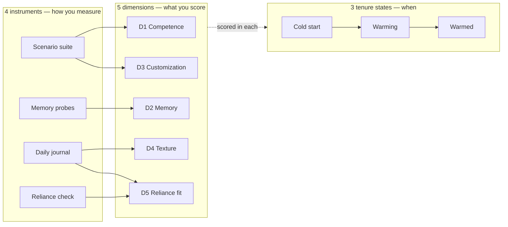

# n3wth/agent-eval

A method for evaluating an AI coworker on the things one-shot benchmarks miss: memory, customization, and trust built over time.

> [!NOTE]
> Design-only. The first runnable step is filling [scenarios/suite.md](scenarios/suite.md) with real tasks, which turns the rubric into a baseline.

## Overview

Evaluate the week, not the task.

Benchmarks score an agent on one task in isolation. That tells you the engine works. It tells you nothing about whether you'd want to work with it for a month. A coworker is judged on the relationship: does it remember what you told it, does it learn your conventions, does it know when to ask, does it get better the longer you use it. None of that shows up in a pass-rate.

This repo is a method for scoring that. Hermes is the worked example, but it applies to any agent you'd treat as a coworker rather than a tool.

## What gets scored

Five dimensions, scored 0 to 4, measured by four instruments, across three tenure states. The dimensions are what you score; the tenure axis is when; the instruments are how.

| | Dimension | The question |
|---|-----------|--------------|
| D1 | Competence | Can it do the work, repeatably? |
| D2 | Memory | Does it remember what matters, and only that? |
| D3 | Customization | Can I shape it, and does the change stick? |
| D4 | Texture | Does it ask, push back, admit when stuck? |
| D5 | Reliance fit | Do I delegate to it appropriately? |

D1 is the floor. D2 through D4 are where coworker diverges from tool. D5 is the number you'd quote, and it only reads as a trend.

The same dimension scores differently by tenure: asking many questions is good onboarding at cold start, a failure once the agent should know you. That flip is why the tenure axis exists, and why a flat scorecard misses what a coworker eval is for.

## The two corrections that keep it honest

Two framings look like progress and reward the wrong thing. The eval pairs each against its failure mode.

- **Memory.** "Remember more" rewards hoarding, where every one-off instruction becomes a standing rule. D2 pairs durability (does a preference stick?) against over-application (does an ephemeral one wrongly persist?).
- **Reliance.** "Delegate more" rewards over-trust, and one bad delegation can cost more than weeks of saved time. D5 scores calibrated reliance (relied when the agent was right, overrode when it was wrong), not delegation volume.

Both come from the trust-and-memory literature, cited in [docs/references.md](docs/references.md).

## The tenure axis

An AI coworker is two products depending on how much it already knows you. A stranger and a colleague are different evals, and the split has a name in the trust literature: dispositional trust (what a stranger brings) vs. learned trust (built through use).

| State | Who | What good looks like |
|-------|-----|----------------------|
| Cold start | New user, zero memory, first session | Useful without knowing you. Asks the right onboarding questions. Honest about what it can't know. |
| Warming | A few sessions in | Visibly getting better. Corrections stick. The "it remembered" moment lands. |
| Warmed | Weeks in, rich memory | Invisible competence. Anticipates. Rarely re-asks. |

The gap between the cold and warmed columns is itself a finding: a large gap is the **cold-start cliff** — magic for the builder, unusable for anyone new. A personal agent built by and for one person is at maximum risk of it, and the builder is least able to see it because they are never cold. The wiped-memory cold-start run ([docs/tenure.md](docs/tenure.md)) is how you manufacture the cold start you can't otherwise observe.

## How to run it

Four instruments, escalating in cost and signal. The deliverable is a dated scorecard; its value is the delta between runs, not any single run.

1. **Scenario suite** (D1, D3) — ~10–15 tasks from real work, re-run after every config change. The regression net. Run each task N times and report pass^k (all-of-k succeed), not pass@1. → [scenarios/suite.md](scenarios/suite.md)
2. **Memory probes** (D2) — scripted tell-then-recall across sessions, paired with an over-application check and a memory-disabled control. The only rigorous way to test continuity; impossible single-shot. → [probes/memory.md](probes/memory.md)
3. **Daily journal** (D4, D5) — 1–2 weeks of real use logged on a fixed cadence. → [probes/texture.md](probes/texture.md)
4. **Reliance check** (D5) — RAIR and RSR computed weekly from accept/override events, plus a validated trust scale. Read calibration, not volume.

**Cadence:** baseline cold and warmed → use daily for 1–2 weeks → re-score weekly. → [scorecards/template.md](scorecards/template.md)

## Repo map

| Path | What's in it |
|------|--------------|
| [docs/proposal.md](docs/proposal.md) | The full method. |
| [docs/scorecard.md](docs/scorecard.md) | The rubric: five dimensions by tenure, scored 0 to 4. |
| [docs/tenure.md](docs/tenure.md) | The three passes, including the wiped-memory cold-start run. |
| [docs/frameworks.md](docs/frameworks.md) | Comparing whole frameworks, and the OSS tooling per stack layer for running the eval. Benchmarks live here. |
| [docs/references.md](docs/references.md) | The published method behind each dimension. |
| [scenarios/suite.md](scenarios/suite.md) | The D1/D3 task suite (a template; fill with real work). |
| [probes/memory.md](probes/memory.md) | D2 multi-session tell/recall, durability paired with discrimination. |
| [probes/texture.md](probes/texture.md) | D4 ask/push-back/admit-stuck, plus the daily journal. |
| [scorecards/template.md](scorecards/template.md) | A blank scored run with a date column. |
